# Week 08 - Work with table: 1D analysis and 2D analysis

<div id="toc">
<!-- TOC -->

- [Week 08 - Work with table: 1D analysis and 2D analysis](#week-08---work-with-table-1d-analysis-and-2d-analysis)
    - [Objective](#objective)
    - [More Arithmetics on DataFrame and Series](#more-arithmetics-on-dataframe-and-series)
        - [Exercise: The Berkeley admission synthesis dataset](#exercise-the-berkeley-admission-synthesis-dataset)
    - [Distribution](#distribution)
        - [Histogram](#histogram)
            - [Bonus: How histograms can be cheating](#bonus-how-histograms-can-be-cheating)
        - [Kernel Density Estimation (KDE)](#kernel-density-estimation-kde)
        - [Special points in distribution](#special-points-in-distribution)
    - [Bonus: Articulate central tendency and spread of data](#bonus-articulate-central-tendency-and-spread-of-data)
        - [Variance](#variance)
        - [Skewness](#skewness)
        - [Kurtosis](#kurtosis)
    - [Correlation](#correlation)
        - [Continuous: Scatter plot and correlation](#continuous-scatter-plot-and-correlation)
        - [Bonus: Better visualisation](#bonus-better-visualisation)
            - [Filter out in the charts](#filter-out-in-the-charts)
            - [A more primitive/ finer controlled way of plotting using matplotlib](#a-more-primitive-finer-controlled-way-of-plotting-using-matplotlib)
        - [Discrete: Cross-tab](#discrete-cross-tab)
            - [DataFrame.groupby](#dataframegroupby)
            - [pandas.pivot_table](#pandaspivot_table)
                - [Discretise multiple columns](#discretise-multiple-columns)
                - [pivot_table to generate cross-tabs table](#pivot_table-to-generate-cross-tabs-table)
        - [From correlation to causality](#from-correlation-to-causality)
    - [Bonus: (Statistical) Hypothesis testing](#bonus-statistical-hypothesis-testing)
    - [Reference](#reference)

<!-- /TOC -->
</div>

## Objective

- Master the schema of "data-driven story telling": the crowd \(pattern\) and the outlier \(anomaly\)
- Can use `pandas`, `matplotlib` and `seaborn` to conduct 1D analysis and articulate on the statistics
- Can conduct 2D analysis by:
  - `pandas.pivot_table()` -- discrete distribution analysis (bin analysis)
  - `pandas.groupby().aggreate()` -- the SAC (splitting -- applying -- combining) pattern
  - `Series.corr()` -- calculate correlation
  - `DataFrame.plot()` or `matplotlib.pyplot.plot()` -- scatter plot to visualise 2D correlation

The dataset and case we use this week comes from a workshop called "descriptive analysis" conducted by Jenifer on GICJ2017 in South Africa. You can download data from:

* www.jenster.com/nottingham.xlsx
* www.jenster.com/index.xlsx

New modules:

* [Matplotlib](https://matplotlib.org/). Matplotlib is a Python 2D plotting library and one of the most frequently used plotting modules in Python.
* [Seaborn](https://seaborn.pydata.org/). Seaborn is a Python data visualization library based on matplotlib. It provides a high-level interface for drawing attractive and informative statistical graphics.

## More Arithmetics on DataFrame and Series

Series has many arithmetic funcitons. Although one can easily implement those functions with basic `list` and basic logics in Python, those provided by `Series` can save some time by writing for loops, because they are design to work on "a series of numbers". Examples are like:

- `.sum()`
- `.min()`
- `.max()`
- `.quantile()`

Two `Series` of the same length can use conventional arithmetics and boolean operators to perform an **element-wise** operation. For example:

- `a + b` - result is a new Series whose values are the element-wise addition from `a` and `b`.
- `a == b` - result is a new Series whose values are element-wise `==` logical operation.

When one hand side of the equation is not a Series, but a "scalar", i.e. single number, this single number is used in all operations with all elements from another Series.

Many functions that are available for `Series` are also available for `DataFrame`. A `DataFrame` is in essense a collection of `Series`. To apply those functions that works on `Series` to `DataFrame`, we need to have certain ordering, which is given by a keyword parameter called `axis`:

- Operate along columns (`axis=0`)
- Operate along rows (`axis=1`)

**TIP**: Sometimes, one may be used to column operations or row operations, when writing his/ her computation logics. It is Ok to stick with one convention. When you need to operate along another axis, use the **transpose** version of the DataFrame, i.e. `DataFrame.T` (Use it like a member variable).

With the progress of data processing, the table at your hand is usually larger and larger. You may want to put the new result back to original table sometimes. There are mainly two ways:

- Adding a new column is easy. Just use `df['new-column'] = A valid Sereis`.
- Adding a new row needs some more work. Use `pandas.concat([df, row])`, where `df` is the original DataFrame; and `row` is the new DataFrame with one data point, whose columns are the same as `df`.

### Exercise: The Berkeley admission synthesis dataset

Calculate the by-department admission ratio and the whole-school admission ratio. Try to articulate whether there is gender discrimination or not.

The dataset can be downloaded [here](assets/1973-UC-Berkeley-Admission-Data-Synthesis-Data.csv).

For further reading, search for "Simpson's paradox".

## Distribution

For distribution, we can use some simple pandas statistics functions to get a overall picture of whats the data distribution like, from what we can get at least two analyzing directions:

1. Is there a clear trend or a pattern of the distribution?
2. Is there any abnormal or outliers that worthy noticing?

The following is the analyzing demo after we get a clean dataset, based on the example of *Cheating our children* case, and try to find insights.

### Histogram

```python
import pandas as pd
from matplotlib import pyplot as plt
import seaborn as sns
import numpy as np
df = pd.read_excel('nottingham.xlsx')
df.describe() #get descriptive information
```


The columns:

* `AVG_ENG_MATH_SCORE_xx`: The average score for the particular class of year xx. For a class, this metric is the higher the better
* `P_ABSENT_PERSIST`:  the absent ratio transformed somehow, the higher the worse.

This is multi dimensional data. We are interested in the relationship between those dimensions / variables. For example, the absent ratio.

```python
%matplotlib inline  #add this line before plotting charts
df['P_ABSENT_PERSIST'].hist(bins=20)
```


Quick Questions:

* What do you conclude from this histogram?
* What would you do next to mine the news?

It's clear that most of school has only 0 - 2 absent ratio, but 2 schools has more than 8 percent absent ratio. A question for us is why those two schools are abnormal and who are they? We can filter out to dig out more, and see if we can find anything interesting.


Also, one can check out the other columns and see if there anything abnormal or trend.

```python
plt.subplot(2, 2, 1)
df['AVG_ENG_MATH_SCORE_07'].hist(bins=10)
plt.title('AVG_ENG_MATH_SCORE_07')

plt.subplot(2, 2, 2)
df['AVG_ENG_MATH_SCORE_08'].hist(bins=10)
plt.title('AVG_ENG_MATH_SCORE_08')


plt.subplot(2, 2, 3)
df['AVG_ENG_MATH_SCORE_09'].hist(bins=10)
plt.title('AVG_ENG_MATH_SCORE_09')


plt.subplot(2, 2, 4)
df['AVG_ENG_MATH_SCORE_10'].hist(bins=10)
plt.title('AVG_ENG_MATH_SCORE_10')
```


Same question: can you find anything notable from this chart? It that weird for the outlier whose score is around 15 in year 7? We can filter it out and invest later.

```python
df[df['AVG_ENG_MATH_SCORE_07'] < 16]
```


#### Bonus: How histograms can be cheating

Try to adjust number of bins and bin boundaries to see what happens.

```python
df['AVG_ENG_MATH_SCORE_08'].hist(bins=5) #bins=5
```


```python
df['AVG_ENG_MATH_SCORE_08'].hist(bins=25) #bins = 25
```


```python
df['P_ABSENT_PERSIST'].hist(bins=8,range=(0,4)) #change data range
```


You can see that there is only one peak when the number of bins is 5, however, if you enlarges `bins`, you will get a more detailed information. There appears more peaks and a valley between. Besides, if you change the data range, the situation and conclusion here can be more diverse.

The key takeaway here is that different angle could lead to different stories, and it's all depend on which angle you choose to take in. What we can do is to learn to recognize the pattern here and not to be fooled by the charts.

<!-- 
    TODO: 
    try this section and see if you can generate different shapes? which leads to different story?

    If no, still show the possibilities by changing 
    1) the number of bins
    2) the position of boundaries

    Need to discuss with me regarding this result.

-->

<!-- TODO:

    Update 1108: 
    AVG_ENG_MATH_SCORE_08 seems a better case to demonstrate "how histogram can be cheating".

    Basically, there seems to be "two peaks", when # bin is set to 10. When # bin is set to other values, there could be "one peak", or "more peaks". Those lead to different interpretation. Many histogram has this effect due to small sample size.

 -->

### Kernel Density Estimation (KDE)

KDE is fundamentally similar to histogram. It takes every data point, interpolate the distribution using a continuous function (kernel), and then sum up those functions to generate the envelop of distribution. It has similar function when you articulate the distribution of data. The major advantage is that it does not suffer from the bin-segmentation issue as we see above in histogram.

For better data presentation and aesthetics purpose, people sometimes put histogram and KDE on the same chart, from which you can see the distribution pattern more clearly.

```python
ax = df['AVG_ENG_MATH_SCORE_10'].hist(bins=15)
df['AVG_ENG_MATH_SCORE_10'].plot(kind='kde', ax=ax, secondary_y=True)
```


### Special points in distribution

- Mean


The statistical mean, gives a very good idea about the central tendency of the data being collected. What can we get from the mean? you can have a general idea that overall, students get better performance in higher grades, but is it normal?

- Max/ Min


The max and min shows the most extreme observations. If extreme values are real (not measurement errors), it becomes valuable to us, giving us a breakthrough point to dig out the reason, which we emphasis at the very beginning of this course - abnormal.

For this case, we can filter out the school with highest absent rate and see if there is anything interesting. Step further, we can filter out the school with high absent rate but high performance in score at the same time.
This is also abnormal for us in theory which we can further check out.


- Median

```python
df["AVG_ENG_MATH_SCORE_10"].median()
```

Output:

```text
27.8
```

Median provides a helpful measure of center of our dataset. But more often, we care more about the Percentile, like where are the majority of the data locate.

- Percentile

Percentile is a given percentage of observations in a group of observations fall. For example, the 75th percentile is the value (or score) below which 75% of the observations may be found.


## Bonus: Articulate central tendency and spread of data

### Variance

variance is the expectation of the squared deviation of a random variable from its mean. Informally, it measures how far a set of (random) numbers are spread out from their average value. The smaller the variance, the sharper the distribution. The variance is the square of the `standard deviation`.


*from Wikipedia*

```python
df[['AVG_ENG_MATH_SCORE_07','AVG_ENG_MATH_SCORE_08','AVG_ENG_MATH_SCORE_09','AVG_ENG_MATH_SCORE_10']].var(axis=0).sort_values(ascending=False)
```

Output:

```text
AVG_ENG_MATH_SCORE_07    4.128475
AVG_ENG_MATH_SCORE_10    2.983547
AVG_ENG_MATH_SCORE_08    2.778986
AVG_ENG_MATH_SCORE_09    2.694271
```

For this case, we can see that the score fluctuations of students in year 7 are the largest. And there is no clear pattern only considering this factor.

### Skewness

Skewness can help us recognize the general distribution pattern, whether it is feasible to treat it as a normal distribution. If Sk> 0, the larger the Sk value, the higher the degree of right deviation; If Sk< 0, the smaller the Sk value, the higher the degree of left deviation.


*from Wikipedia*

```python
df[['AVG_ENG_MATH_SCORE_07','AVG_ENG_MATH_SCORE_08','AVG_ENG_MATH_SCORE_09','AVG_ENG_MATH_SCORE_10']].skew(axis=0).sort_values(ascending=False)
```

Output:

```text
AVG_ENG_MATH_SCORE_09   -0.038742
AVG_ENG_MATH_SCORE_10   -0.152395
AVG_ENG_MATH_SCORE_08   -0.224148
AVG_ENG_MATH_SCORE_07   -1.352412
```

From the results, we can have a overview of that the scores distribution of those students is left deviated, and mass students is concentrated on the right of the figure. And there is no apparent pattern related to the years.

### Kurtosis

The kurtosis reflects the sharpness of the peak of the distribution. The greater the kurtosis, the sharper and steeper of the distribution peak. A high kurtosis means that the increase in variance is caused by an extreme values in the low frequency that is greater or less than the average.

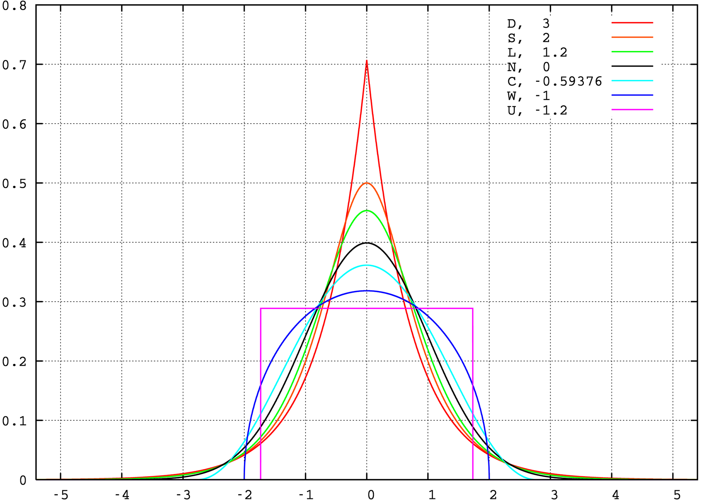
*from Wikipedia*

```python
df[['AVG_ENG_MATH_SCORE_07','AVG_ENG_MATH_SCORE_08','AVG_ENG_MATH_SCORE_09','AVG_ENG_MATH_SCORE_10']].kurtosis(axis=0).sort_values(ascending=False)
```

Output:

```text
AVG_ENG_MATH_SCORE_07    6.934606
AVG_ENG_MATH_SCORE_10   -0.036167
AVG_ENG_MATH_SCORE_08   -0.428693
AVG_ENG_MATH_SCORE_09   -0.478333
```

From this statistic, we can know that students in year 7 has larger kurtosis, which means that the distribution peak is sharper, and there are more extreme value points in year 7.

## Correlation

### Continuous: Scatter plot and correlation

We can plot the correlation graph to display relationship between two variables and columns. For example, to figure out whether there is a correlation between absence and score.

```python
df.plot('P_ABSENT_PERSIST', 'AVG_ENG_MATH_SCORE_09', kind='scatter')
#kind means the graph type
```


Generally, you can see that the higher the absence ratio, the lower the test score in general. But here are two questions:

* Is this relationship strong enough?
* What are the outliers?

To solve this problem, we need to use correlation functions to dig out more.

```python
help(df['P_ABSENT_PERSIST'].corr)
```

Output:
```test
Help on method corr in module pandas.core.series:

corr(other, method='pearson', min_periods=None) method of pandas.core.series.Series instance
    Compute correlation with `other` Series, excluding missing values
    
    Parameters
    ----------
    other : Series
    method : {'pearson', 'kendall', 'spearman'}
        * pearson : standard correlation coefficient
        * kendall : Kendall Tau correlation coefficient
        * spearman : Spearman rank correlation
    min_periods : int, optional
        Minimum number of observations needed to have a valid result
    
    
    Returns
    -------
    correlation : float
```

From above you can see that, `corr` function is used to compute one series with other series. And there are 3 methods: `pearson`, `kendall`, `spearman`. we don't need necessarily to know how to calculate instead
we need to what does it means and main differences. For example, `person` measure the degree of the relationship between `linearly` related variables, while Spearman rank correlation is a `non-parametric test`. For more details, You can refer [here](http://www.statisticssolutions.com/correlation-pearson-kendall-spearman/)

```python
df['P_ABSENT_PERSIST'].corr(df['AVG_ENG_MATH_SCORE_09'], method='pearson')
```

output:

```text
-0.5205965225654683
```

**Note:**

* Pearson correlation is between [-1, 1]
* Values around 0 means no correlation/ weak correlation
* Values near 1 and -1 can be interpreted as strong (linear) correlation

Pearson correlation does not work very well with `non-linear correlation` or when the variables are not (jointly) normally distributed. It is also sensitive to outliers. Spearman rank correlation can help here. You can make a judgement whether there is a correlation between grades and absent rate.

```python
df['P_ABSENT_PERSIST'].corr(df['AVG_ENG_MATH_SCORE_10'],method='spearman')
df['P_ABSENT_PERSIST'].corr(df['AVG_ENG_MATH_SCORE_09'], method='spearman')
df['P_ABSENT_PERSIST'].corr(df['AVG_ENG_MATH_SCORE_08'], method='spearman')
df['P_ABSENT_PERSIST'].corr(df['AVG_ENG_MATH_SCORE_07'], method='spearman')
```


### Bonus: Better visualisation

```python
sns.regplot(df['P_ABSENT_PERSIST'], df['AVG_ENG_MATH_SCORE_09'])
```

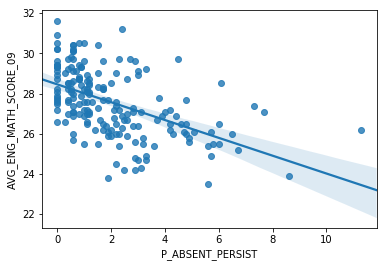

```python
np.polyfit(df['P_ABSENT_PERSIST'].fillna(0), df['AVG_ENG_MATH_SCORE_09'].fillna(0), 1)
```

**Quiz:** What does it look like if we plot above line? The return value of polyfit is Polynomial coefficients, highest power first.

**NOTE:** Try the codes without fillna and observe the error. Now it is time to do some cleaning.

```python
na_selector = df['P_ABSENT_PERSIST'].isna()
na_selector |= df['AVG_ENG_MATH_SCORE_07'].isna()
na_selector |= df['AVG_ENG_MATH_SCORE_08'].isna()
na_selector |= df['AVG_ENG_MATH_SCORE_09'].isna()
na_selector |= df['AVG_ENG_MATH_SCORE_10'].isna()
len(df[na_selector])
len(df)
len(df[~na_selector])
df_cleaned = df[~na_selector]
np.polyfit(df_cleaned['P_ABSENT_PERSIST'].fillna(0), 
           df_cleaned['AVG_ENG_MATH_SCORE_09'].fillna(0), 
           1)
```


After we get the regression coefficient, we can estimate the grade09 and compare with the actual ones to see if there is a big difference.

```python
absent = df_cleaned['P_ABSENT_PERSIST']
score_grade09 = df_cleaned['AVG_ENG_MATH_SCORE_09']
estimated_score_grade09 =  28.54239409 + (-0.44654826) * absent
(score_grade09 - estimated_score_grade09).hist()
```

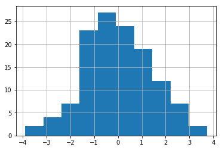

We can filter out the school that have hugh different scores with the estimation.

```python
df_cleaned[(score_grade09 - estimated_score_grade09) > 3]
df_cleaned[(score_grade09 - estimated_score_grade09) > 2.5]
```

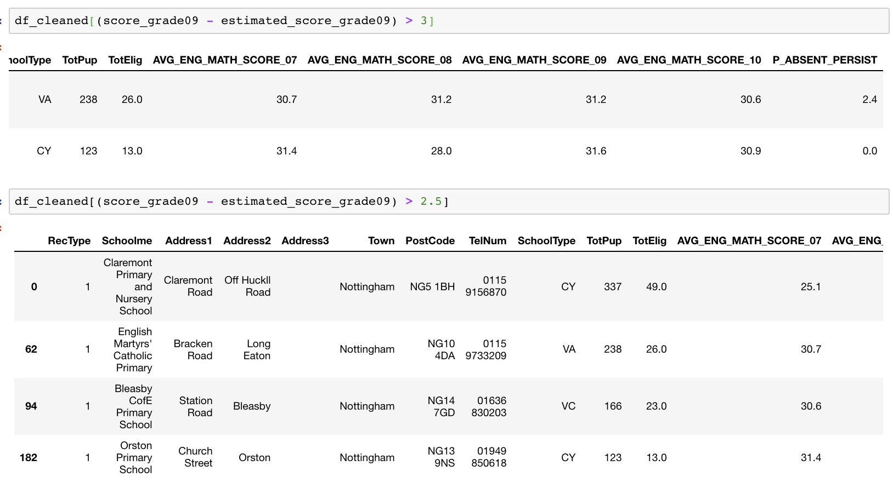

#### Filter out in the charts

Get the threshold value for 95% percentile

```python
s.quantile(0.95)
df_cleaned[s > s.quantile(0.95)].plot(
    x='P_ABSENT_PERSIST', 
    y='AVG_ENG_MATH_SCORE_09', 
    kind='scatter')
```

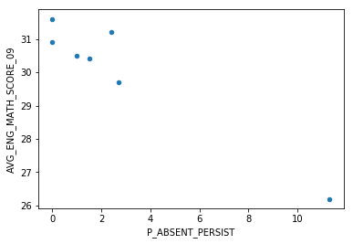

Adjust the quantile to include/ exclude suspicious schools.

```python
ax = sns.regplot(
    df_cleaned['P_ABSENT_PERSIST'], 
    df_cleaned['AVG_ENG_MATH_SCORE_09'],
)
df_cleaned[s > s.quantile(0.90)].plot(
    x='P_ABSENT_PERSIST', 
    y='AVG_ENG_MATH_SCORE_09', 
    kind='scatter',
    color='red',
    ax=ax)
```

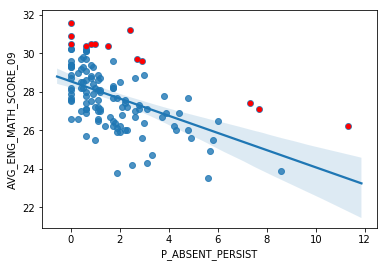

#### A more primitive/ finer controlled way of plotting using matplotlib

Two common tricks for better visuals:

* Add jitter to further scatter the data points
* Use transparency to help identify density

```python
plt.figure(figsize=(10, 5))
plt.scatter(
    df_cleaned['P_ABSENT_PERSIST'], 
    df_cleaned['AVG_ENG_MATH_SCORE_09'],
    s=80, alpha=0.5)
```

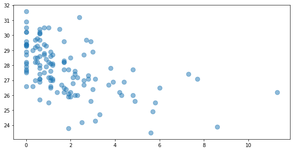

```python
plt.figure(figsize=(10, 5))
plt.scatter(
    df_cleaned['P_ABSENT_PERSIST'] + np.random.normal(0, 0.1, len(df_cleaned)), 
    df_cleaned['AVG_ENG_MATH_SCORE_09'] + np.random.normal(0, 1, len(df_cleaned)),
    s=80, alpha=0.5)
```

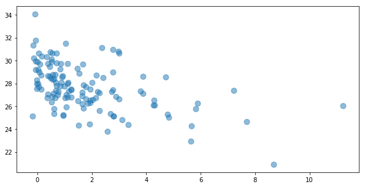

```python
coeffs = np.polyfit(df_cleaned['P_ABSENT_PERSIST'].fillna(0), 
           df_cleaned['AVG_ENG_MATH_SCORE_09'].fillna(0), 
           1)
trendline_x = np.linspace(df_cleaned['P_ABSENT_PERSIST'].min(), df_cleaned['P_ABSENT_PERSIST'].max())
trendline_y = coeffs[0] * trendline_x + coeffs[1]
plt.figure(figsize=(10, 5))

plt.scatter(
    df_cleaned['P_ABSENT_PERSIST'] + np.random.normal(0, 0.1, len(df_cleaned)), 
    df_cleaned['AVG_ENG_MATH_SCORE_09'] + np.random.normal(0, 1, len(df_cleaned)),
    s=80, alpha=0.5)

plt.plot(trendline_x, trendline_y, linewidth=5)

plt.scatter(
    df_cleaned[s > s.quantile(0.90)]['P_ABSENT_PERSIST'],
    df_cleaned[s > s.quantile(0.90)]['AVG_ENG_MATH_SCORE_09'],
    color='red'
)
```

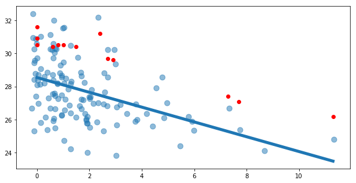

Jitter is good to present data but you need to track how the data is jittered in order to aligh multiple plots. The complete version is followed.

```python
plt.figure(figsize=(10, 5))

# Plot main bubbles

x = df_cleaned['P_ABSENT_PERSIST']
x_jitter = x + np.random.normal(0, 0.05, len(df_cleaned))
y = df_cleaned['AVG_ENG_MATH_SCORE_09'] 
y_jitter = y + np.random.normal(0, 0.1, len(df_cleaned))

plt.scatter(
    x_jitter, 
    y_jitter,
    s=80, alpha=0.5)

# Fit the curve (a line) and plot trendline

coeffs = np.polyfit(x, y, 1)

trendline_x = np.linspace(x.min(), x.max())
trendline_y = coeffs[0] * trendline_x + coeffs[1]

plt.plot(trendline_x, trendline_y, linewidth=5)

# Identify suspecious schools, highlight and label texts

estimated_y = coeffs[0] * x + coeffs[1]
s = y - estimated_y

suspecious_x = x_jitter[s > s.quantile(0.90)].values
suspecious_y = y_jitter[s > s.quantile(0.90)].values
suspecious_t = df_cleaned[s > s.quantile(0.90)]['Schoolme'].values
plt.scatter(
    suspecious_x,
    suspecious_y,
    color='red'
)
for i in range(len(suspecious_t)):
    plt.text(suspecious_x[i], suspecious_y[i], suspecious_t[i])
```

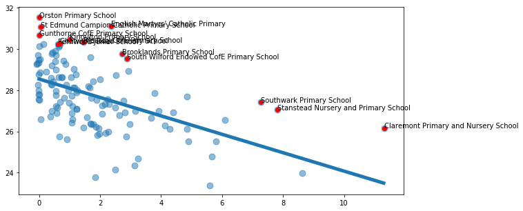

### Discrete: Cross-tab

#### DataFrame.groupby

Different groups with different absent rate may show different correlation with their scores. We can divide the absent rate with different groups to check out the situation here.

We name the `absent rate <1` as `hardworking group`,`absent rate 1<=rate<3` as `middle group`, and `absent rate >3` as `happy group`.

```python
def discretise(x):
    if x <= 1:
        x = 'hard_working'
    elif x > 1 and x <= 3:
        x = 'middle'
    elif x > 3:
        x = 'happy'
    return x
f = ['mean','max','min','var','std']
df['group'] = df['P_ABSENT_PERSIST'].apply(discretise)
year9_agg = yeardf.groupby('group')['AVG_ENG_MATH_SCORE_09'].agg(f)
year9_agg.sort_values(f,ascending=False)
```

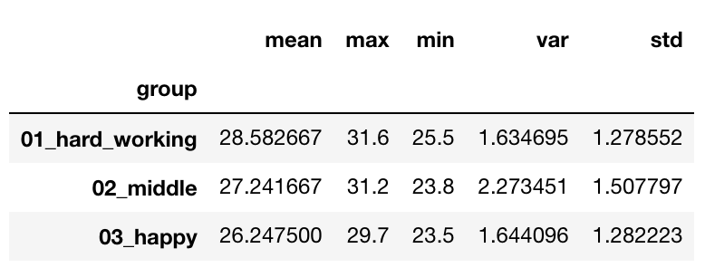

From the results, we can find the pattern that the more hardworking, the better performance students in their scores, which shows on the mean of their scores. However Middle group shows more diverse in this correlation, which can be explained by our experience. Because most of students are located in this area and the samples are more diverse. To the contrary, hardworking students get good grades and happy students get lower grades generally.

#### pandas.pivot_table

##### Discretise multiple columns

```python
# discretise all all-year students scores
df['grade_07'] = df['AVG_ENG_MATH_SCORE_07'].apply(discretise)
df['grade_08'] = df['AVG_ENG_MATH_SCORE_08'].apply(discretise)
df['grade_09'] = df['AVG_ENG_MATH_SCORE_09'].apply(discretise)
df['grade_10'] = df['AVG_ENG_MATH_SCORE_10'].apply(discretise)
```

##### pivot_table to generate cross-tabs table

For example, to see whether higher score07 leads to higher score10?

<!-- TODO：
    Not a conventional use of pivot table.

    The current way basically **enumerates the data points** because school name is supposed to be unique.
    
    Try: 
    
    df.pivot_table(index=['grade_07'], columns=['grade_10'], values='Schoolme', aggfunc='count')
-->

```python
df.pivot_table(index=['grade_07'], columns=['grade_10'], values='Schoolme', aggfunc='count')
```

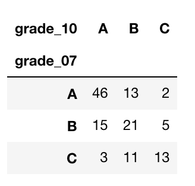

From this charts we can found out most students with grade A in year7 will still get good grades in year10. About 46/61 = 72%.

Q2：Does lower absent ratio leads to higher score08?

```python
df.pivot_table(index=['group'], columns=['grade_08'], values='Schoolme', aggfunc='count')
```

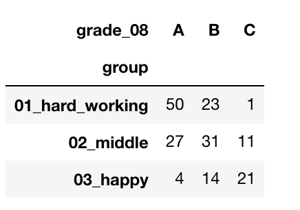

Generally, we can see that it matches to our speculation. Low-absent-rate group(hard_working) got most A grade, about 50/81 = 62%, while only 5% of high-absent-rate group got A.

Q3: Does higher score07 and score08 leads to higher score10?

```python
df.pivot_table(index=['grade_07','grade_08'], columns=['grade_10'], values='Schoolme', aggfunc='count')
rate = a / b
```


The results show highly correlation in this hypothesis. Students in year 7 and year 8 with grade higher than B, and at least one A, is more likely to get A in year 10. About 53/70 = 76%.

An interesting point here, the abnormal one is that 3 schools' students with grade C in year 7 and year 8 got A in year 10. What happened to those schools?  We can filter out those schools.

```python
df[(df['grade_07']=='C') & (df['grade_08']=='C') & (df['grade_10']=='A')]
```


After we got those school names and address, next thing is to investigate on the stories behind the data.

<!-- TODO: 
    1) Discretise multiple columns:
    - core07, score08, ... score10 ✅
    - absent ratio ✅
    - total number of pupil  ❓what does this mean???
    
    Update 1108: TotPup -- Total pupil (pupil means "student in primary school")
    Update 1108: TotElig -- Total eligible (not all pupil is eligible to attend the test)
    

    2) Use pandas.pivot_table to generate crosstabs. Some motivating questions:
    - does higher score07 leads to higher score10? ✅
    - does lower absent ratio leads to higher score08? ✅
    - does higher score07 and score08 leads to higher score10?
-->

### From correlation to causality

Seeking for causality is one of the constant persuit of journalists. However, data and statistics can not help too much here. Correlation is an objective measure. No matter which correlation you use, as long as the mathematical formula is defined, you can get an exact number. However, causaility is subjective, which can not be calculated, but can be reasoned/ articulated/ discussed. Suppose we already find the correlation between A and B, there are two directions to consider when discussing causality:

1. Whether event A happens before event B? If not, A can not be the cause of B (in a causal world/ regular world)
2. Does the domain knowledge/ physical process restrict A to be the cause of B? e.g. observing correlation intelligent parents `<->` intelligent children, we know parents should come first.

The discussion causality is hard to be thorough. That is why, as journalist, once you get the facts (data analysis/ investigation/ desktop research/ ...), it is a common practice to consult experts for comments and insights.

## Bonus: (Statistical) Hypothesis testing

Hypothesis testing is a common statistical tool used in social research domain. Suppose we have observations in `X`, the general process is as follows:

- Establish "null hypothesis" as `H0`, which states that the observation is purely due to chance.
- Calculate the likelihood that we have such observations under null hypothesis, i.e. `P{X | H0}`. This is called "p-value".
- If p-value is small, we reject `H0` because `X` is not likly to happen given that condition. In other words, it is "statistically significant that `X` is not happening purely due to chance" -- in short, 

> lower p-value --> more significant --> "more convincing"

"Think stats" by Allen has a whole Chapter 7 on hypothesis testing. We omit the detailed discussion here. The purpose of this book is to help new learners to acquire essential Python and data analytics/ visualisation skills so that they can articulate the result by "common sense"/ "data sense". Articulating in a rigorous statistical language is not a requirement here.

In the literatures, people usually put some alternative hypotheses aside `H0`. By reject `H0`, they conclude `H1` or `H2`, ... This is not always correct though. The short message that "lower p-value --> more significant" is a bit misleading. The precise version needs two more elaborations:

- The alternative hypotheses need to be stated in a mutually exclusive and collectively exhaustive way, together with `H0`. Sometimes, people state the alternative not exactly the complement of `H0`.
- Even if when `H0` is rejecrted, we can not draw the conclusion on your research question directly. The rejection happens under the assumed model `M`. Under `M`, `X` is unlikely to happen due to chance. There must be something (some cause). However, this do not give us information on how likely `M` itself is correct.

The short take-away is: Use hypothesis with caution. When in double, just do a full reporting on all relevant experiments, tests, results. Leave it to the readers to draw their own conclusions.

## Reference

- Downey, A. B. (2014). Think stats: exploratory data analysis.  O’Reilly Media, Inc. Retrieved from https://the-eye.eu/public/Books/IT%20Various/think_stats.pdf
