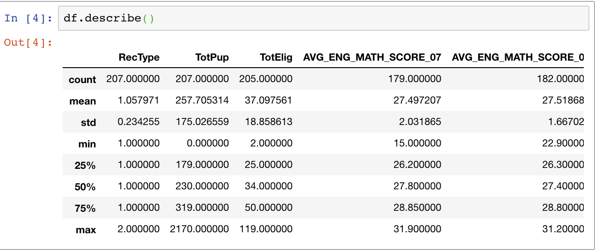
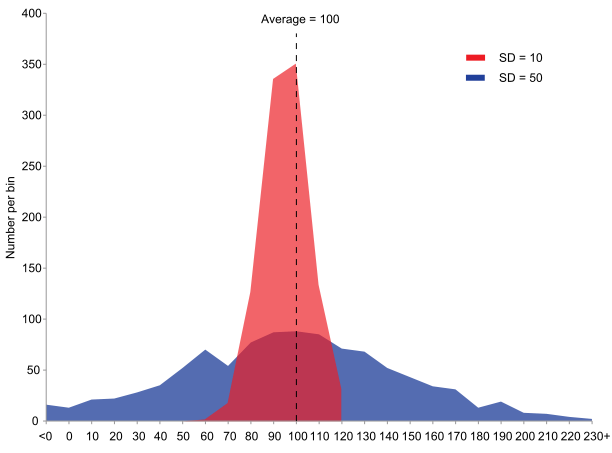

# Week 08 - Work with table: 1D analysis and 2D analysis

<div id="toc">
<!-- TOC -->

- [Week 08 - Work with table: 1D analysis and 2D analysis](#week-08---work-with-table-1d-analysis-and-2d-analysis)
    - [Objective](#objective)
    - [Distribution](#distribution)
        - [Histogram and KDE](#histogram-and-kde)
            - [Bonus: How histograms can be cheating](#bonus-how-histograms-can-be-cheating)
        - [Special points in distribution](#special-points-in-distribution)
    - [Bonus: Articulate central tendency and spread of data](#bonus-articulate-central-tendency-and-spread-of-data)
        - [Variance](#variance)
        - [Skewness](#skewness)
        - [Kurtosis](#kurtosis)
    - [Correlation](#correlation)
        - [Continuous: Scatter plot and correlation](#continuous-scatter-plot-and-correlation)
        - [Discrete: Cross-tab and correlation](#discrete-cross-tab-and-correlation)
        - [From correlation to causality](#from-correlation-to-causality)
    - [Bonus: (Statistical) Hypothesis testing](#bonus-statistical-hypothesis-testing)

<!-- /TOC -->
</div>

## Objective

- Master the schema of "data-driven story telling": the crowd \(pattern\) and the outlier \(anomaly\)
- Can use `pandas`, `matplotlib` and `seaborn` to conduct 1D analysis and articulate on the statistics
- Can conduct 2D analysis by:
  - `pandas.pivot_table()` -- discrete distribution analysis (bin analysis)
  - `pandas.groupby().aggreate()` -- the SAC (splitting -- applying -- combining) pattern
  - `Series.corr()` -- calculate correlation
  - `DataFrame.plot()` or `matplotlib.pyplot.plot()` -- scatter plot to visualise 2D correlation

The dataset and case we use this week comes from a workshop called "descriptive analysis" conducted by Jenifer on GICJ2017 in South Africa. You can download data from:

* www.jenster.com/nottingham.xlsx
* www.jenster.com/index.xlsx

New modules:

* [Matplotlib](https://matplotlib.org/). Matplotlib is a Python 2D plotting library and one of the most frequently used plotting modules in Python.
* [Seaborn](https://seaborn.pydata.org/). Seaborn is a Python data visualization library based on matplotlib. It provides a high-level interface for drawing attractive and informative statistical graphics.

## Distribution

<!-- Obj: 
- visual analysis;
- can filger based on visual clues (1-D);
- can investigate special data points;
 -->

### Histogram and KDE

```python
import pandas as pd
from matplotlib import pyplot as plt
import seaborn as sns
import numpy as np
df = pd.read_excel('nottingham.xlsx')
df.describe() #get descriptive information
```



The columns:

* `AVG_ENG_MATH_SCORE_xx`: The average score for the particular class of year xx. For a class, this metric is the higher the better
* `P_ABSENT_PERSIST`:  the absent ratio transformed somehow, the higher the worse.

This is multi dimensional data. We are interested in the relationship between those dimensions/ variables.

```python
len(df)
df['P_ABSENT_PERSIST'].hist(bins=20)
```


Quick Question:
* What do you conclude from this histogram?
* What would you do next to mine the news?

```python
df['AVG_ENG_MATH_SCORE_07'].hist(bins=20)
```


Same question: can you find anything notable from this chart? It that weird for the outlier whose score is around 15? How do we filter that out?

```python
df[df['AVG_ENG_MATH_SCORE_07'] < 16]
```


#### Bonus: How histograms can be cheating

Try to adjust number of bins and bin boundaries to see what happens.

### Special points in distribution

<!-- TODO:
- functions
- can filter out interesting pionts for further discussion
- Mean
-->

- Mean


The statistical mean, gives a very good idea about the central tendency of the data being collected. What can we get from the mean? you can have a general idea that overall, students get better performance in higher grades, but is it normal?

- Max/ Min


The max and min shows the most extreme observations. If extreme values are real (not measurement errors), it becomes valuable to us, giving us a breakthrough point to dig out the reason, which we emphasis at the very beginning of this course - abnormal.

For this case, we can filter out the school with highest absent rate and see if there is anything interesting. Step further, we can filter out the school with high absent rate but high performance in score at the same time.
This is also abnormal for us in theory which we can further check out.


- Median

```python
df["AVG_ENG_MATH_SCORE_10"].median()
```

Output:

```text
27.8
```

Median provides a helpful measure of center of our dataset. But more often, we care more about the Percentile, like where are the majority of the data locate.

- Percentile

Percentile is a given percentage of observations in a group of observations fall. For example, the 75th percentile is the value (or score) below which 75% of the observations may be found.


## Bonus: Articulate central tendency and spread of data

### Variance

variance is the expectation of the squared deviation of a random variable from its mean. Informally, it measures how far a set of (random) numbers are spread out from their average value. The smaller the variance, the sharper the distribution. The variance is the square of the `standard deviation`.


*from Wikipedia*

```python
df[['AVG_ENG_MATH_SCORE_07','AVG_ENG_MATH_SCORE_08','AVG_ENG_MATH_SCORE_09','AVG_ENG_MATH_SCORE_10']].var(axis=0).sort_values(ascending=False)
```

Output:

```text
AVG_ENG_MATH_SCORE_07    4.128475
AVG_ENG_MATH_SCORE_10    2.983547
AVG_ENG_MATH_SCORE_08    2.778986
AVG_ENG_MATH_SCORE_09    2.694271
```

For this case, we can see that the score fluctuations of students in year 7 are the largest. And there is no clear pattern only considering this factor.

### Skewness

Skewness can help us recognize the general distribution pattern, whether it is feasible to treat it as a normal distribution. If Sk> 0, the larger the Sk value, the higher the degree of right deviation; If Sk< 0, the smaller the Sk value, the higher the degree of left deviation.


*from Wikipedia*

```python
df[['AVG_ENG_MATH_SCORE_07','AVG_ENG_MATH_SCORE_08','AVG_ENG_MATH_SCORE_09','AVG_ENG_MATH_SCORE_10']].skew(axis=0).sort_values(ascending=False)
```

Output:

```text
AVG_ENG_MATH_SCORE_09   -0.038742
AVG_ENG_MATH_SCORE_10   -0.152395
AVG_ENG_MATH_SCORE_08   -0.224148
AVG_ENG_MATH_SCORE_07   -1.352412
```

From the results, we can have a overview of that the scores distribution of those students is left deviated, and mass students is concentrated on the right of the figure. And there is no apparent pattern related to the years.

### Kurtosis

The kurtosis reflects the sharpness of the peak of the distribution. The greater the kurtosis, the sharper and steeper of the distribution peak. A high kurtosis means that the increase in variance is caused by an extreme values in the low frequency that is greater or less than the average.


*from Wikipedia*

```python
df[['AVG_ENG_MATH_SCORE_07','AVG_ENG_MATH_SCORE_08','AVG_ENG_MATH_SCORE_09','AVG_ENG_MATH_SCORE_10']].kurtosis(axis=0).sort_values(ascending=False)
```

Output:

```text
AVG_ENG_MATH_SCORE_07    6.934606
AVG_ENG_MATH_SCORE_10   -0.036167
AVG_ENG_MATH_SCORE_08   -0.428693
AVG_ENG_MATH_SCORE_09   -0.478333
```

From this statistic, we can know that students in year 7 has larger kurtosis, which means that the distribution peak is sharper, and there are more extreme value points in year 7.

## Correlation

### Continuous: Scatter plot and correlation

We can plot the correlation graph to display relationship between two variables and columns. For example, to figure out whether there is a correlation between absence and score.

```python
df.plot('P_ABSENT_PERSIST', 'AVG_ENG_MATH_SCORE_09', kind='scatter')
#kind means the graph type
```


Generally, you can see that the higher the absence ratio, the lower the test score in general. But here are two questions:

* Is this relationship strong enough?
* What are the outliers?

To solve this problem, we need to use correlation functions to dig out more.

```python
help(df['P_ABSENT_PERSIST'].corr)
```

Output:
```test
Help on method corr in module pandas.core.series:

corr(other, method='pearson', min_periods=None) method of pandas.core.series.Series instance
    Compute correlation with `other` Series, excluding missing values
    
    Parameters
    ----------
    other : Series
    method : {'pearson', 'kendall', 'spearman'}
        * pearson : standard correlation coefficient
        * kendall : Kendall Tau correlation coefficient
        * spearman : Spearman rank correlation
    min_periods : int, optional
        Minimum number of observations needed to have a valid result
    
    
    Returns
    -------
    correlation : float
```

From above you can see that, `corr` function is used to compute one series with other series. And there are 3 methods: `pearson`, `kendall`, `spearman`. we don't need necessarily to know how to calculate instead
we need to what does it means and main differences. For example, `person` measure the degree of the relationship between `linearly` related variables, while Spearman rank correlation is a `non-parametric test`. For more details, You can refer [here](http://www.statisticssolutions.com/correlation-pearson-kendall-spearman/)

```python
df['P_ABSENT_PERSIST'].corr(df['AVG_ENG_MATH_SCORE_09'], method='pearson')
```

output:

```text
-0.5205965225654683
```

**Note:**

* Pearson correlation is between [-1, 1]
* Values around 0 means no correlation/ weak correlation
* Values near 1 and -1 can be interpreted as strong (linear) correlation

Pearson correlation does not work very well with `non-linear correlation` or when the variables are not (jointly) normally distributed. It is also senstive to outliers. Spearman's rank correlation can help here.

```python
df['P_ABSENT_PERSIST'].corr(df['AVG_ENG_MATH_SCORE_09'], method='spearman')
```

Outut:

```text
-0.5810765727681304
```

### Discrete: Cross-tab and correlation

### From correlation to causality

Seeking for causality is one of the constant persuit of journalists. However, data and statistics can not help too much here. Correlation is an objective measure. No matter which correlation you use, as long as the mathematical formula is defined, you can get an exact number. However, causaility is subjective, which can not be calculated, but can be reasoned/ articulated/ discussed. Suppose we already find the correlation between A and B, there are two directions to consider when discussing causality:

1. Whether event A happens before event B? If not, A can not be the cause of B (in a causal world/ regular world)
2. Does the domain knowledge/ physical process restrict A to be the cause of B? e.g. observing correlation intelligent parents `<->` intelligent children, we know parents should come first.

The discussion causality is hard to be thorough. That is why, as journalist, once you get the facts (data analysis/ investigation/ desktop research/ ...), it is a common practice to consult experts for comments and insights.

## Bonus: (Statistical) Hypothesis testing

